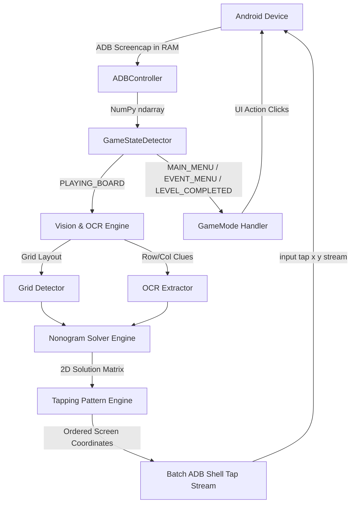

# 🛠️ Technical Architecture & Developer Guide (`DEVELOPMENT.md`)

This document provides in-depth technical details on the architecture, computer vision pipelines, solving algorithms, and automation subsystems of **Nonogram-Solver**.

---

## 🏛️ System Architecture Overview



---

## 🔬 Core Subsystems

### 1. Computer Vision & OCR Subsystem (`src/nonogram/vision/`)
- **Grid Detection (`grid.py`):**
  - Uses horizontal and vertical Sobel filtering / adaptive thresholding to detect line intensity profiles across rows and columns.
  - Automatically derives board cell bounds (`Layout`), grid step sizes (`step_x`, `step_y`), and origin coordinates (`first_x`, `first_y`).
- **Clue Recognition (`ocr.py` & `templates.py`):**
  - Isolates clue bounding regions above and to the left of the board.
  - Uses binary contour bounding-box normalization and multi-scale template matching against standardized number glyphs (1–15).
  - Tolerates variations in font rendering, dark/light themes, and screen resolutions.

### 2. Constraint Propagation Solver Engine (`src/nonogram/solver/`)
- **Line Solver with Dynamic Programming (`engine.py`):**
  - Solves individual lines (rows and columns) against clue constraints using memoized recursion.
  - Generates valid line configurations and intersects them to find definite cell states (1 = filled, 0 = empty).
- **Global Propagation & Backtracking:**
  - Iteratively updates rows and columns until a fixed point is reached.
  - If a puzzle has branch points, Minimum Remaining Values (MRV) heuristic backtracking resolves the board deterministically in **< 10 ms**.

### 3. Tapping Patterns & Input Execution (`src/nonogram/automation/patterns.py` & `src/nonogram/device/adb.py`)
- **Pattern Strategies:**
  - `sequential`: Standard row-by-row top-left to bottom-right.
  - `random`: Uniformly randomized cell permutation.
  - `ping_pong`: Alternates from top-left and bottom-right, meeting in the center.
  - `center_out`: Euclidean radial distance sorting from the board center outward.
  - `reverse`: Inverted bottom-right to top-left.
  - `snake`: Alternating zigzag across consecutive rows.
- **High-Throughput ADB Streaming:**
  - Instead of invoking `adb shell input tap x y` for each cell (which incurs ~50ms process creation overhead per tap), all taps are encoded as a single multi-line batch stream into one interactive ADB shell session:
    ```bash
    input tap 450 1200
    input tap 550 1200
    ...
    ```

### 4. Autonomous State Machine (`src/nonogram/automation/`)
- **`GameStateDetector` (`states.py`):**
  - Classifies current frame into `PLAYING_BOARD`, `MAIN_MENU`, `EVENT_MENU`, `LEVEL_COMPLETED`, `DAILY_RESTART_DIALOG`, or `POPUP_DIALOG`.
- **Mode Handlers (`src/nonogram/automation/modes/`):**
  - `NormalGameMode`: Handles main menu tab checks, starts next levels, solves boards.
  - `DailyChallengeMode`: Solves daily puzzles, detects calendar completion, and cancels restart dialogs.
  - `EventGameMode`: Handles Lilac Roses orange storybook storyboard, progress animations, and level progressions.

---

## 🧪 Testing & Quality Assurance

The repository includes a comprehensive unit and integration test suite:

```powershell
# Run the complete test suite
python -m unittest discover -s tests
```

### Test Coverage:
- `tests/test_vision.py`: Tests OCR and layout extraction on 5x5, 10x10, and 15x15 sample boards.
- `tests/test_solver.py`: Tests the line solver and constraint propagation correctness.
- `tests/test_automation.py`: Tests state machine detections across all UI screens (Main Menu, Daily, Event, Popups).
- `tests/test_patterns.py`: Tests coordinate ordering for all 6 tapping pattern strategies.

---

## 🤝 Contributing Guidelines

1. **Code Style:** Follow PEP 8 guidelines and strict type annotations (`typing`, `dataclasses`).
2. **Deterministic State Handling:** Ensure all new UI screens or game modes have sample fixtures in `assets/samples/` and corresponding unit tests in `tests/`.
3. **No Hardcoded Values:** Always compute screen-relative coordinates dynamically from detected screen dimensions (`width`, `height`).
